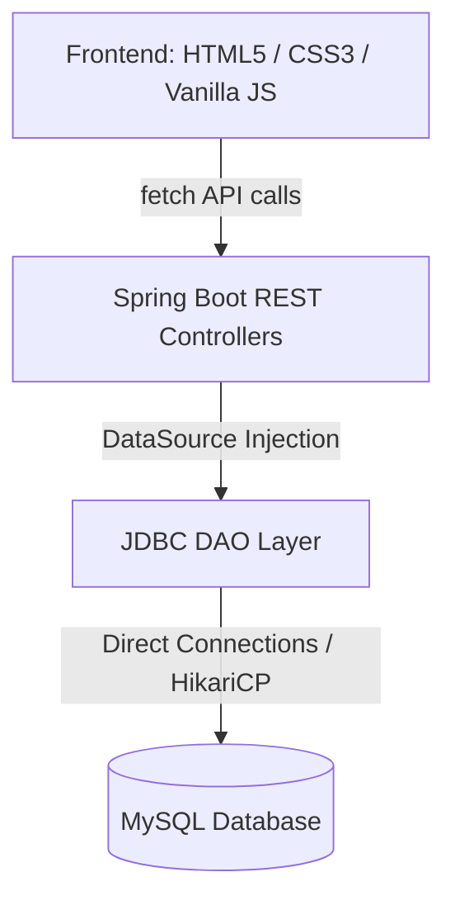

# Order Processing System

A production-ready, high-performance **Order Processing System** built using a Java Spring Boot REST API backend, JDBC DAOs connected to MySQL, and a responsive, modern HTML5/CSS3/Vanilla JS single-page web dashboard.

The application features a dark visual design with a premium **Crimson (#C00000) accent**, toast notifications, real-time analytics, dynamic modals, and client-side caching.

---

## 🏛️ Project Architecture



*   **Backend:** Spring Boot (v3.2.5), Java 17+, Maven.
*   **Database:** MySQL (v8.0+) with HikariCP Connection Pooling.
*   **Frontend:** Vanilla ES6 JavaScript + custom layout CSS, utilizing CORS for cross-origin communication.

---

## 📁 Directory Structure

```text
ORDERPROCESSINGSYSTEM/
├── pom.xml                               # Maven Project Configuration
├── sql/
│   └── schema.sql                        # Database Schema and Seed Data
├── src/
│   ├── main/
│   │   ├── java/src/
│   │   │   ├── controllers/              # REST APIs (Item, Customer, Order)
│   │   │   ├── dao/                      # JDBC Data Access Objects
│   │   │   ├── model/                    # Data Entities
│   │   │   ├── util/                     # DBConnection Class (Utility)
│   │   │   └── OrderProcessingSystemApplication.java  # Spring Boot Main
│   │   └── resources/
│   │       └── application.properties    # Configuration (DB passwords, Ports)
└── web/
    ├── index.html                        # SPA Document
    ├── style.css                         # Custom UI stylesheets
    └── app.js                            # Frontend API handlers
```

---

## ⚙️ Running Globally (Development Setup)

### 1. Database Configuration
Run the schema script to create the database (`order_processing_system`) and populate it with seed items:
```powershell
Get-Content "sql/schema.sql" | & "C:\Program Files\MySQL\MySQL Server 8.0\bin\mysql.exe" -u root -pvalli00
```
To modify connection details (e.g., MySQL user/password), edit:
`src/main/resources/application.properties`

### 2. Run the Java REST Backend
Compile and launch Tomcat (default configuration set to port `9090`):
```powershell
$env:JAVA_HOME = "C:\Program Files\Java\jdk-22"
mvn spring-boot:run
```

### 3. Run the Frontend Server
Because the browser blocks local file URLs (`file:///`), serve the static frontend folder using a local web server (e.g. on port `8000`):
```powershell
cd web
python -m http.server 8000
```
Open **[http://localhost:8000](http://localhost:8000)** in your browser.

---

## 📈 Functional Test Scenarios

1.  **Item Management:** Register new items using the form. Check the automated "Reorder" status warnings if quantity drops below threshold levels.
2.  **Customer Directory:** Add active customers and view them in the Customer Registry.
3.  **Place Order:** Compile multi-row client purchases. Check real-time inventory updates (deductions from stock quantity) and transactional rollback on failures.
4.  **Reports & Charts:** View total completed sales, total revenue, and average transaction amount. Pull filters for *Recent 7 days orders*, *Max/Min extreme sales*, and *Top Consumers*.

---

## 🛸 Deployment Guide

When preparing to deploy this project to production:

### 1. Backend Package (JAR File)
To compile and package the Java Spring Boot backend into an executable fat JAR:
```powershell
mvn clean package
```
This builds a file `target/order-processing-system-1.0.0.jar`. You can run this JAR on any production server with Java 17+ installed:
```bash
java -jar target/order-processing-system-1.0.0.jar
```

### 2. Frontend Production Alignment
In a production deployment, serving the frontend via a standard web server (like Nginx, Apache HTTP Server, or cloud hosting like AWS S3/CloudFront) is highly recommended:
*   Copy files inside `/web/*` (`index.html`, `app.js`, `style.css`) to the webroot directory of your Nginx instance.
*   Edit the `API_BASE` constant in `app.js` (line 5) to point to your public-facing production backend URL (e.g., `https://api.yourdomain.com/api` or relative `/api` paths if proxying).
*   For automated deployments, you can configure Nginx to proxy API requests to port `9090`:
    ```nginx
    location /api/ {
        proxy_pass http://localhost:9090/api/;
        proxy_set_header Host $host;
        proxy_set_header X-Real-IP $remote_addr;
    }
    ```
